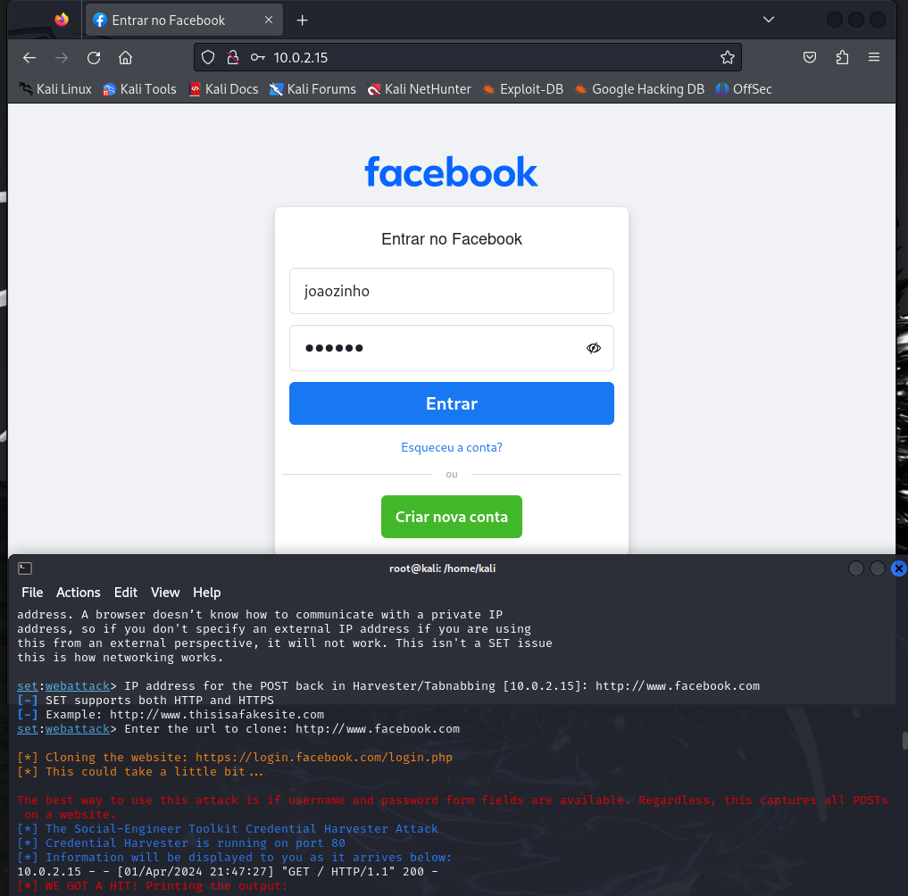

# Curso Cybersecurity - Phishing para captura de senhas do Facebook

## Ferramentas
- Kali Linux
- setoolkit
___

## Passo a Passo

- Iniciando o setoolkit
- Tipo de ataque: Social-Engineering Attacks
___

- Vetor de ataque: Web Site Attack Vectors
___

- Método de ataque: Credential Harvester Attack Method | Site Cloner
___

- URL para clone: http://www.facebook.com
___

## Resultado

___
